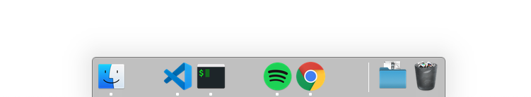

# mdock


Configure your dock with .yml file

## Example

```yaml
dock:
  mineffect: scale
  autohide: true
  autohide-time-modifier: 0
  autohide-delay: 0
  orientation: bottom
  tilesize: 45
  persistent-apps:
    - spacer
    - /Applications/Visual Studio Code.app
    - /Applications/iTerm.app
    - spacer
    - /Applications/Spotify.app
    - /Applications/Google Chrome.app
    - spacer
```



## Installation

```bash
$ gem install pniedzwiedzinski-mdock
```

## Usage

TODO: Write usage instructions here

## Development

After checking out the repo, run `bin/setup` to install dependencies. You can also run `bin/console` for an interactive prompt that will allow you to experiment.

To install this gem onto your local machine, run `bundle exec rake install`. To release a new version, update the version number in `version.rb`, and then run `bundle exec rake release`, which will create a git tag for the version, push git commits and tags, and push the `.gem` file to [rubygems.org](https://rubygems.org).

## Contributing

Bug reports and pull requests are welcome on GitHub at https://github.com/[USERNAME]/mdock. This project is intended to be a safe, welcoming space for collaboration, and contributors are expected to adhere to the [Contributor Covenant](http://contributor-covenant.org) code of conduct.

## License

The gem is available as open source under the terms of the [MIT License](https://opensource.org/licenses/MIT).

## Code of Conduct

Everyone interacting in the Mdock project’s codebases, issue trackers, chat rooms and mailing lists is expected to follow the [code of conduct](https://github.com/[USERNAME]/mdock/blob/master/CODE_OF_CONDUCT.md).
